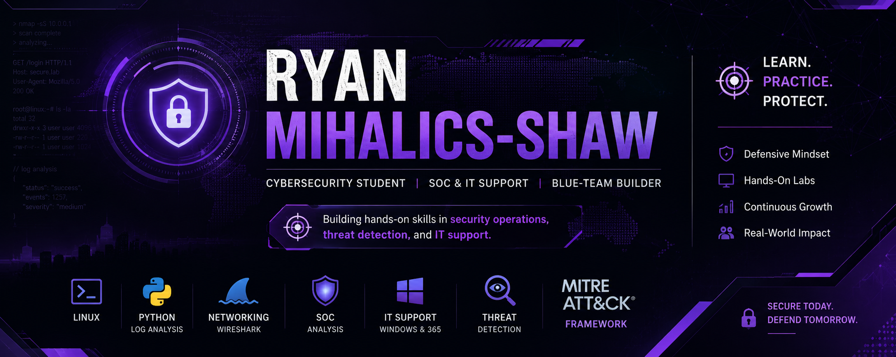

# Hi, I'm Ryan Mihalics-Shaw 👋

I am a cybersecurity student and emerging IT support and security professional building hands-on skills in SOC analysis, Python log analysis, networking, Linux, and threat detection.

My current focus is on developing practical, job-ready skills for IT support, SOC operations, alert triage, log analysis, and blue-team security work.

## Career Focus

I am currently building toward roles such as:

* IT Support Specialist
* Help Desk Technician
* Technical Support Specialist
* NOC Technician
* SOC Analyst Tier 1
* Security Support Analyst

## Technical Skills

* Python scripting for cybersecurity tasks
* Linux command line and system fundamentals
* Networking fundamentals, including DNS, DHCP, TCP/IP, and basic troubleshooting
* Wireshark packet analysis
* Active Directory basics
* Microsoft 365 support
* Virtual machines and lab environments
* Log analysis and alert triage
* MITRE ATT&CK fundamentals
* Technical documentation

## Featured Repositories

### Purple Team Cybersecurity Journey

A hands-on learning repository documenting my growth in SOC analysis, threat detection, log analysis, Linux, networking, Python, and purple team fundamentals.

Repository: [purple-team-journey](https://github.com/CyberSecRYAN/purple-team-journey)

### Cybersecurity Portfolio

A collection of cybersecurity projects, assessments, notes, and research documenting my technical development.

Repository: [Cybersecurity-Portfolio](https://github.com/CyberSecRYAN/Cybersecurity-Portfolio)

## Current Learning Goals

* Build practical SOC Analyst skills
* Strengthen Python for cybersecurity automation
* Practice Wireshark and network traffic analysis
* Improve Linux and Windows security fundamentals
* Document labs clearly for recruiter and hiring manager review
* Continue building visible project proof through GitHub

## Connect With Me

* LinkedIn: [linkedin.com/in/cyberotto](https://www.linkedin.com/in/cyberotto)
* GitHub: [github.com/CyberSecRYAN](https://github.com/CyberSecRYAN)
